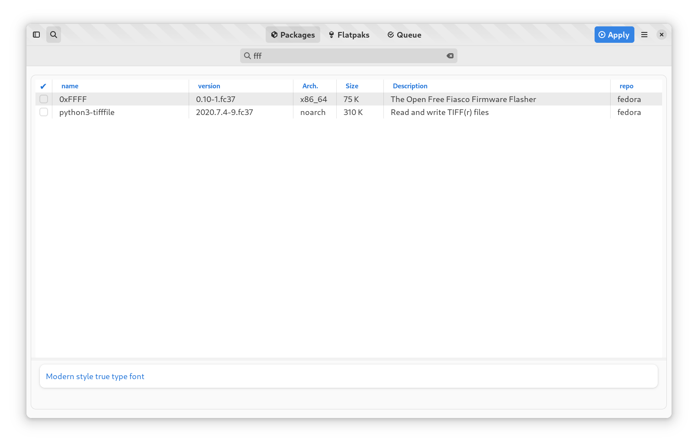
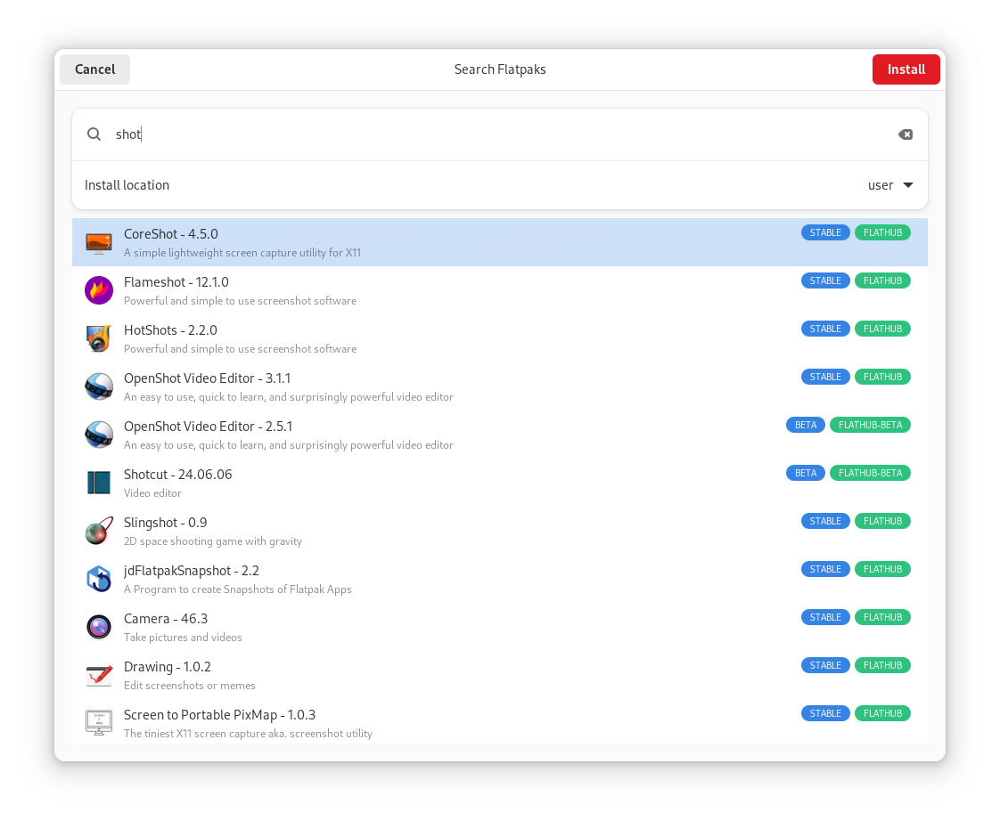

# Yum Extender (NextGen)

This is repository contains the first steps to create a future yum extender
with a more modern look & feel using gtk4/libadwaita etc.

The first steps is to build the GUI and later the real package handling functionality will be added

Follow news on the development on 

# how to test

- check out this repository
- install deps `make inst-deps`
- run `./local.sh`

# Packages for Fedora 37 & Rawhide

[Fedora Copr Repo](https://copr.fedorainfracloud.org/coprs/timlau/yumex-ng/)

# what is working

It is pretty early in development, but the basics are working

- View packages filtered by installed, updates & available
- Seach packages by name as you type (used .arch=noarch for searching for noarch in arch (.desc=... , .repo=..., .desc=...))
- Add packages to queue
- About Yum Extender
- Appling the queue to the system

# what is not working

- No group support
- No history support
- Automatic download and approval of new GPG keys for repositories
- Changing enabled repositories in preferences
 

# current look

## Packages Page
 

## package view settings
 

## package search
 

## Queue Page
 

## flatpaks page
 

## flatpak installer
 

